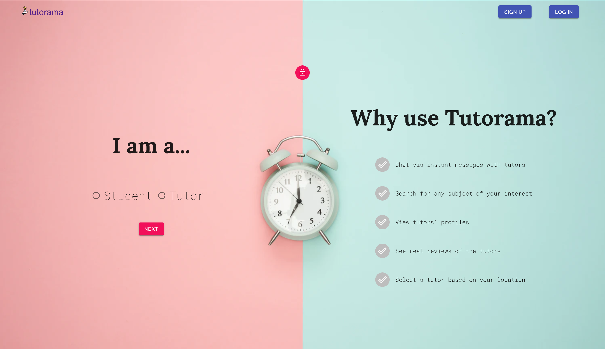
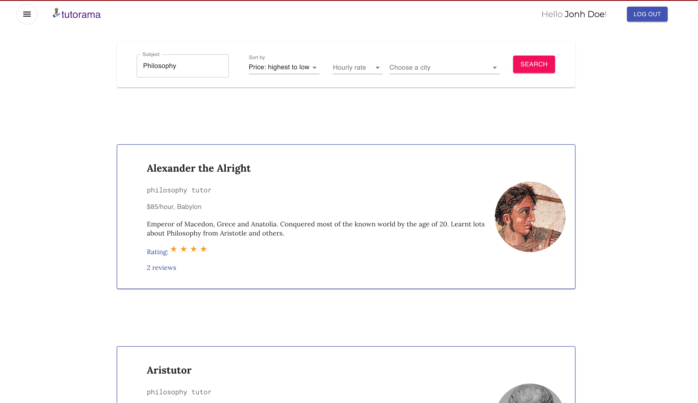
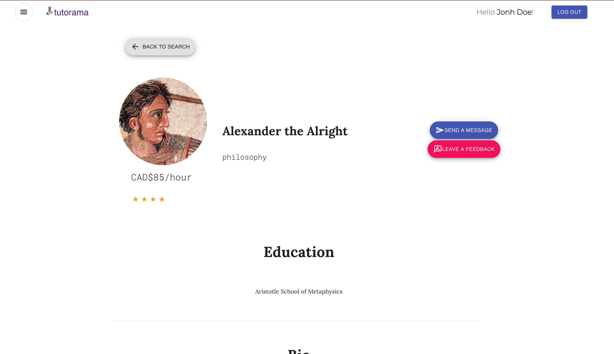
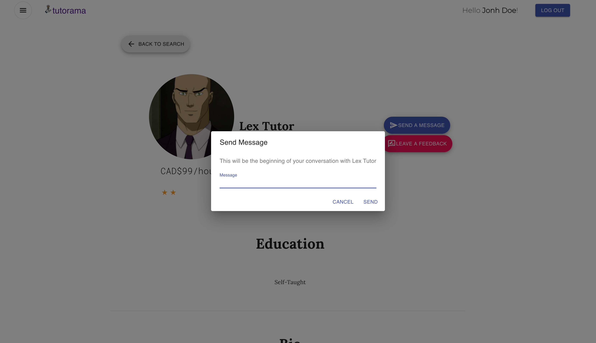
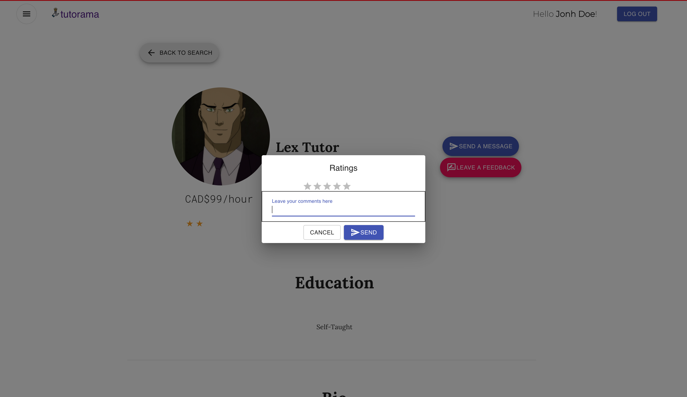
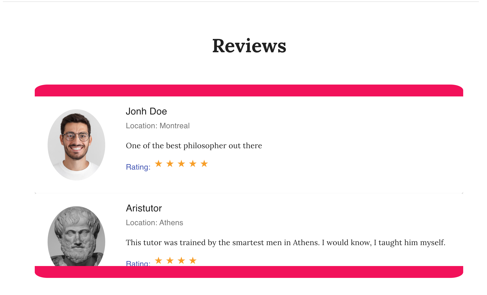
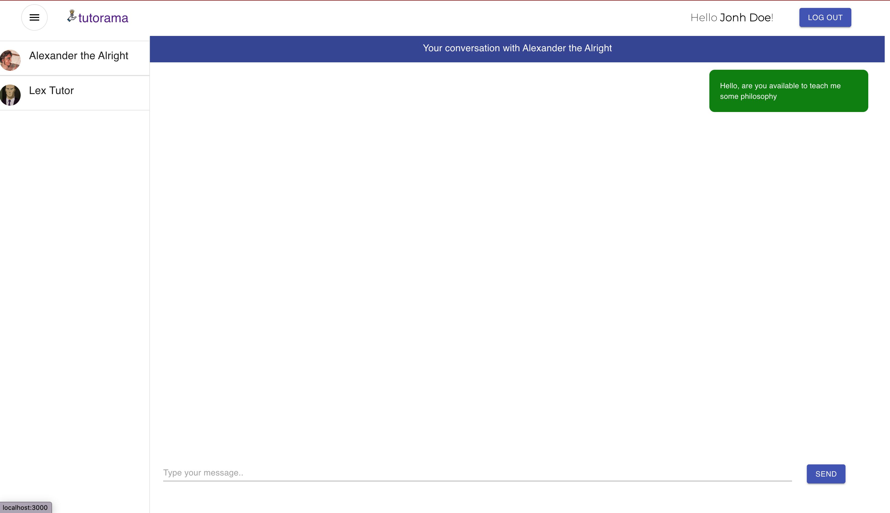
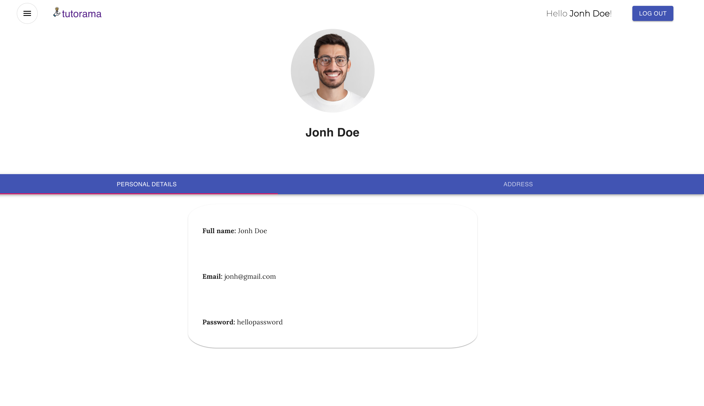
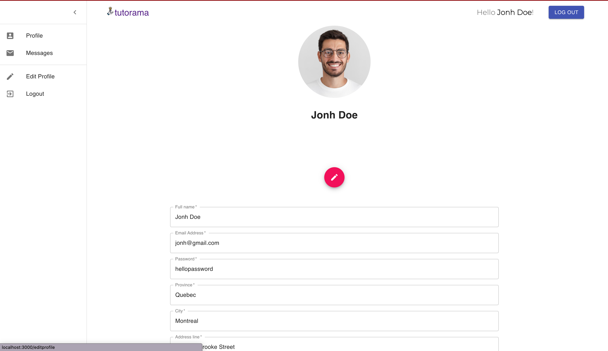

# Tutorama

So, you want to learn Calculus, Accounting, or Biology? Or maybe improve existing knowledge in French, Poetry or even Web Design? If yes, then Tutorama is here to help you reach your fullest potential. Tutorama App is a platform that makes it easy for students to search for a best-fit tutor in the area, view their subjects, qualifications, rates, and real reviews. With this app, a student can easily connect with a preferred tutor for extra support through real-time messages and set up a private session at a convenient time and place. So go on - get searching, there’s a tutor for everyone!

## Project Stack

**Front-End**
React, Material-UI, CSS + Javascript
**Back-End**
Express.js, Node.js, PostgreSQL

## Contributors

[Oluwatobi A. Bello](https://github.com/Oluwatobii).<br />
[Kate Batrakova](https://github.com/katebatrakova).<br />
[Cyril Saidane](https://github.com/csaidane).

## Getting Started

This project has two main folders:

- Install dependencies with `npm install` in both the clent-side(frontend) and server-side(backend).
- On the [server](https://github.com/csaidane/Tutorama/tree/master/backend) side, Copy the `.env.example` file to `.env` and fill in the necessary PostgreSQL configuration. The `node-postgres` library uses these environment variables by default.

```
DB_HOST=localhost
DB_USER=YOUR_USERNAME_HERE
DB_PASS=YOUR_PASSWORD_HERE
DB_NAME=YOUR_DATABASE_NAME_HERE
# Uncomment and set to true for Heroku
# DB_SSL=true if heroku
DB_PORT=5432
```

- Run the [server](https://github.com/csaidane/Tutorama/tree/master/backend) from the root folder using `npm run local`
- Reset the database by running the command `npm run db:reset` from the [server](https://github.com/csaidane/Tutorama/tree/master/backend) side.
- On a separate terminal, run the [client-side server](https://github.com/csaidane/Tutorama/tree/master/frontend) from project root folder using `npm start`

## Api

Example of data gotten from the [back-end server](https://github.com/csaidane/Tutorama/tree/master/backend)

### Tutor info

`GET /api/tutors/profile/:id`

Response

```json
{
  "user_info": [
    {
      "id": 793,
      "name": "Akeem Drake",
      "email": "mattis.Integer.eu@urnaVivamus.com",
      "password": "leo.",
      "street": "P.O. Box 311, 8205 Donec Street",
      "city": "Galway",
      "province": "Connacht",
      "post_code": "211978",
      "profile_picture_url": "https://picsum.photos/200/300"
    }
  ],
  "tutor": [
    {
      "id": 793,
      "education": "McGill University ",
      "bio": "Lorem ipsum dolor sit amet, consectetuer adipiscing elit. Curabitur sed tortor. Integer",
      "rate_per_hour": 42,
      "name": "math "
    }
  ],
  "reviews": [
    {
      "reviewer_id": 913,
      "comment": "Fusce mollis. Duis sit amet diam eu dolor egestas rhoncus. Proin nisl sem, consequat nec, mollis vitae, posuere at, velit.",
      "rating": "3",
      "date": "2021-08-22T04:00:00.000Z",
      "name": "Sylvester Dixon",
      "profile_picture_url": "https://picsum.photos/200/300",
      "city": "Berlin"
    },
    {
      "reviewer_id": 1,
      "comment": "Poor testing",
      "rating": "1",
      "date": "2020-09-06T04:00:00.000Z",
      "name": "Oluwatobi A Bello",
      "profile_picture_url": "https://picsum.photos/200/300",
      "city": "Toronto"
    },
    {
      "reviewer_id": 1,
      "comment": "Wondering if this works",
      "rating": "5",
      "date": "2020-09-06T04:00:00.000Z",
      "name": "Oluwatobi A Bello",
      "profile_picture_url": "https://picsum.photos/200/300",
      "city": "Toronto"
    }
  ]
}
```

## Dependencies

- react: 16.9.0,
- react-dom: 16.9.0,
- react-hooks-testing-library: 0.6.0,
- react-scripts: 3.0.0,
- react-test-renderer: 16.13.1,
- axios: 0.19.2,
- classnames: 2.2.6,
- node-sass: 4.14.1,
- sass: 1.26.10,

## Final Product

- Sign Up Page
  

- Home Page
  

- Search Result
  

- Tutor Profile
  

- Sending Messages
  

- Leaving Feedback
  

- Reviews
  

- Messages
  

- Student Profile
  

- Edit Profile
  

## Current Functionalities

- Create student profile
- Create tutor profile
- View Tutor profile (no. of reviews, ratings, etc…)
- Search and view the list of tutors based on features (Location, Ratings, \$/hour, Curriculum/Topics).
- Add ratings and comments
- Communicating with tutor (Direct-Messaging in the app)

## Further Development

- Admin Interface.
- Report a tutor.
- Location on Google maps (leaflets)
- Show an in-depth curriculum of topics of each tutor.
- Appointment Schedule made with tutors.
- Payment Structure.
